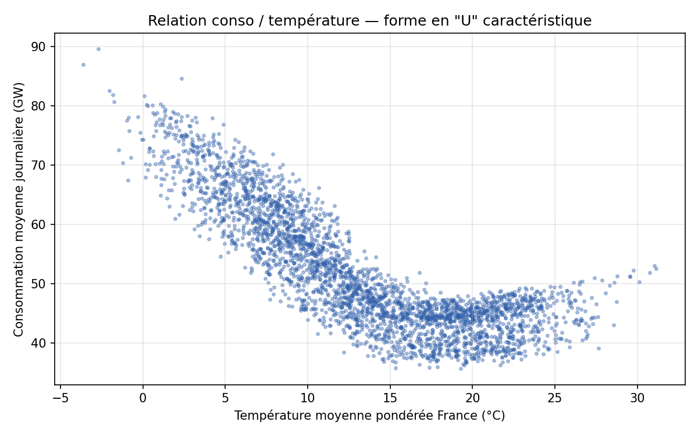

# Modélisation du marché de l'électricité français

Projet personnel de modélisation quantitative appliqué au marché de l'électricité,
construit pour illustrer une compréhension du métier de **pricing analyst** (risque
volume, thermosensibilité, merit order, mécanisme de capacité, prix négatifs) avec des
données ouvertes et un code reproductible.

Trois volets, tous construits sur les mêmes données RTE éCO2mix (2018-2026) :

1. **Thermosensibilité de la consommation** (modèle prédictif, testé hors échantillon)
   → [`outputs/rapport.md`](outputs/rapport.md)
2. **Fondamentaux du marché** (merit order, mécanisme de capacité, prix négatifs,
   profil de consommation) illustrés sur données réelles
   → [`outputs/rapport_marche.md`](outputs/rapport_marche.md)
3. **Construction du prix d'un contrat** (coût de forme, coût de capacité, prime de
   risque volume) — méthodologie explicite, hypothèses de calibration détaillées
   → [`outputs/rapport_pricing.md`](outputs/rapport_pricing.md)

## Résultats clés

> **+1°C en dessous de 18°C ⇒ +1,5 GW de consommation moyenne journalière en France.**
> Modèle testé hors échantillon sur 2025 : erreur moyenne absolue ≈ 2 GW (4,2 % de la
> consommation moyenne).

> **La part éolien + solaire est passée de ≈ 8 % à ≈ 20 % de la consommation française
> entre 2018 et 2026** — la mécanique derrière la fréquence croissante des prix bas /
> négatifs à la mi-journée.

> **Un profil de consommation thermosensible génère un surcoût indicatif d'≈ 7,5 €/MWh
> par rapport à un profil plat**, décomposé en coût de forme, coût de capacité et prime
> de risque volume — chaque composante tracée à ses hypothèses de calcul.




## Structure du projet

```
├── src/
│   ├── fetch_conso.py         # Téléchargement conso + mix RTE éCO2mix (ODRE, opendatasoft)
│   ├── fetch_weather.py       # Téléchargement températures Open-Meteo (11 villes)
│   ├── build_dataset.py       # Fusion + feature engineering -> dataset journalier
│   ├── model_consumption.py   # Régression thermosensibilité (HDD/CDD)
│   ├── explore_market.py      # Merit order, courbe monotone, duck curve, etc.
│   └── pricing.py             # Construction du prix : coût de forme, capacité, risque
├── data/
│   ├── raw/                   # Données brutes téléchargées (ignorées par git, ~1M+ lignes)
│   └── processed/
│       └── daily_dataset.csv  # Dataset journalier final (conso, temp, calendrier)
├── outputs/
│   ├── rapport.md             # Rapport thermosensibilité
│   ├── rapport_marche.md      # Rapport fondamentaux marché (merit order, capacité...)
│   ├── rapport_pricing.md     # Rapport construction du prix d'un contrat
│   ├── figures/                # Graphiques générés (01-05 : thermosensibilité, 11-15 : marché, 21-22 : pricing)
│   ├── key_results.json       # Chiffres clés (thermosensibilité)
│   ├── key_results_marche.json # Chiffres clés (fondamentaux marché)
│   ├── key_results_pricing.json # Chiffres clés (construction du prix)
│   └── model_summary.txt      # Sortie statsmodels complète (régression OLS)
└── requirements.txt
```

## Reproduire les résultats

```bash
pip install -r requirements.txt

# 1. Télécharger les données brutes (conso RTE + météo, ~2-5 min)
python src/fetch_conso.py --start 2018-01-01 --end 2026-06-30
python src/fetch_weather.py --start 2018-01-01 --end 2026-06-30

# 2. Construire le dataset journalier
python src/build_dataset.py

# 3. Estimer le modèle de thermosensibilité
python src/model_consumption.py

# 4. Fondamentaux marché (merit order, courbe monotone, duck curve...)
python src/explore_market.py

# 5. Construction du prix (coût de forme, capacité, prime de risque)
python src/pricing.py
```

Les figures et chiffres clés sont régénérés dans `outputs/`.

## Méthode en bref

1. **Données** : consommation nationale quart-horaire (RTE éCO2mix, 2018-2026) et
   température horaire pour 11 grandes villes (Open-Meteo), agrégées en une
   température "France" pondérée par la population régionale.
2. **Feature engineering** : degrés-jours de chauffe (base 18°C) et de climatisation
   (base 24°C) pour capturer la relation non-linéaire en "U" entre conso et
   température, plus calendrier (jour de semaine, mois, jours fériés, tendance
   annuelle).
3. **Modèle** : régression linéaire (OLS, `statsmodels`), entraînée sur 2018-2024
   (hors 2020, atypique COVID), validée hors échantillon sur 2025.
4. **Évaluation** : R² in-sample, MAE/RMSE/MAPE out-of-sample, et analyse qualitative
   des pires jours de prévision (vagues de froid, jours fériés atypiques).

## Sources de données

| Source | Usage | Lien |
|---|---|---|
| RTE éCO2mix (ODRE) | Consommation, mix de production | https://odre.opendatasoft.com/explore/dataset/eco2mix-national-cons-def/ |
| Open-Meteo | Températures horaires historiques | https://open-meteo.com/en/docs/historical-weather-api |

## Limites (assumées, détaillées dans le rapport)

- Proxy de température par 11 villes pondérées population, pas le maillage officiel
  RTE (32 stations pondérées conso régionale).
- Tendance annuelle supposée linéaire (fragile sur un horizon de prévision long).
- Vacances scolaires non modélisées (source ouverte simple non trouvée).
- Effet des vagues de froid prolongées probablement sous-estimé par un modèle
  purement journalier (pas de mémoire des jours précédents).

Voir [`outputs/rapport.md`](outputs/rapport.md) section 6 pour le détail et la
discussion associée.
