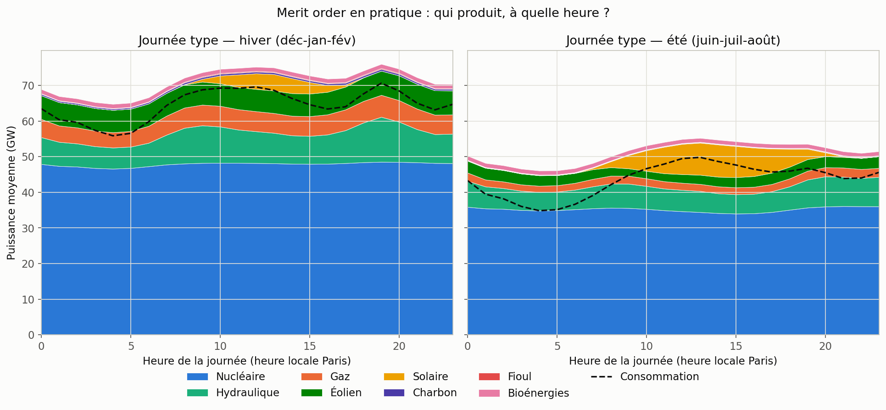
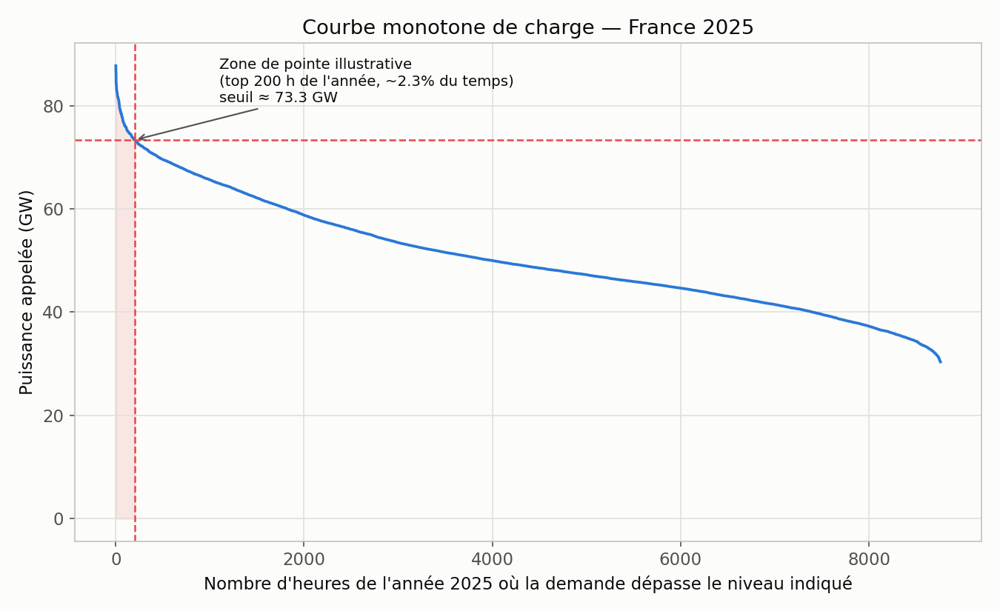
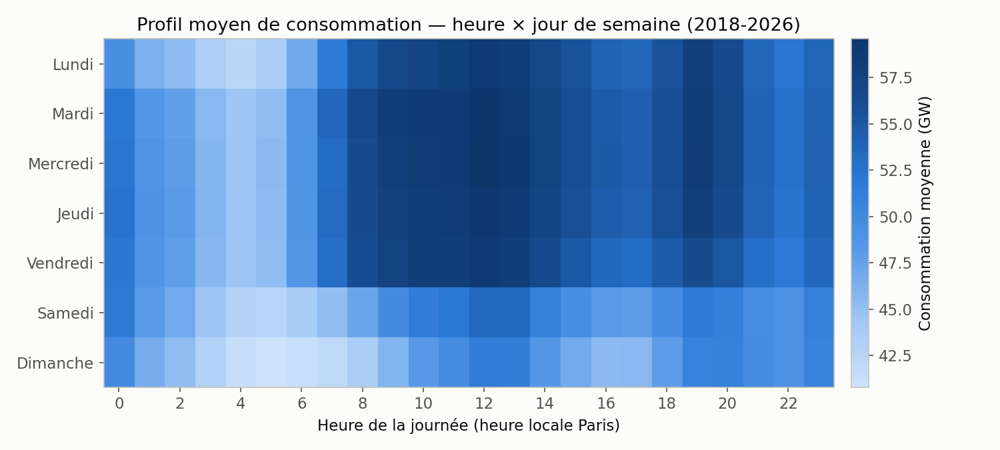
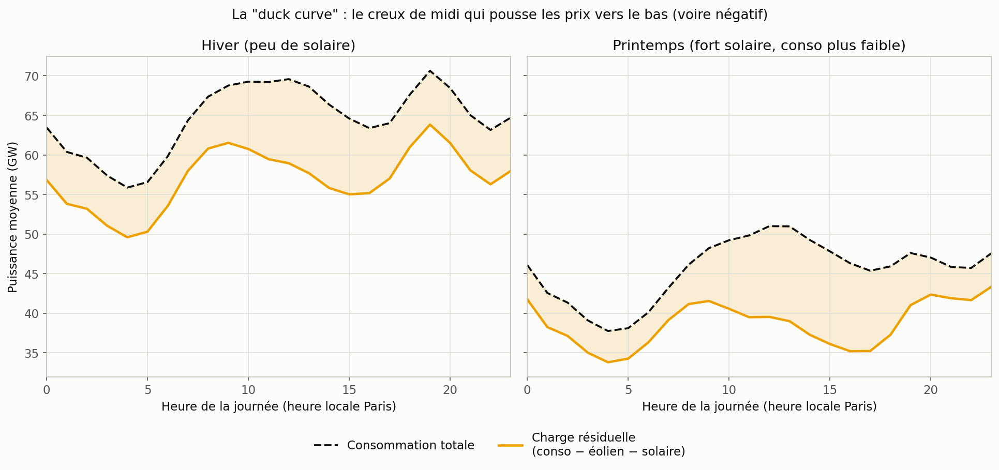
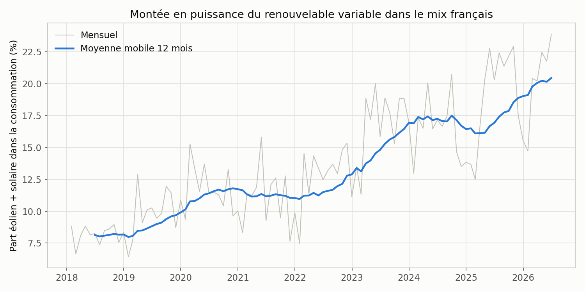

# Fondamentaux du marché électrique français — illustrés par la donnée

*Généré à partir de `src/explore_market.py`, sur les mêmes données RTE éCO2mix que
l'analyse de thermosensibilité (2018-2026, quart-horaire, mix de production complet).
Chiffres tirés de `outputs/key_results_marche.json`.*

Contrairement au [rapport principal](rapport.md) (thermosensibilité, un vrai modèle
prédictif testé hors échantillon), ce document est **descriptif** : il s'agit de
vérifier, sur données réelles, les mécanismes de marché qu'un pricing analyst doit
savoir expliquer (merit order, mécanisme de capacité, prix négatifs, profil de
consommation). Pas de régression ici — des agrégats et des graphiques, mais choisis et
lus comme le ferait un analyste.

## 1. Merit order : qui produit, à quelle heure

Le nucléaire (bleu) forme un socle quasi plat toute la journée — c'est la définition
même du **base load** : un moyen de production qu'on ne module pas à l'heure près, coût
marginal faible, tourne en continu. Au-dessus, l'hydraulique et le gaz suivent la
courbe de demande (ligne noire pointillée) : ce sont les moyens **flexibles** qui
"remplissent" l'écart entre le socle nucléaire et la demande réelle.

> **Le gaz tourne ~1,4× plus fort à la pointe du soir hiver (18h-20h, ≈ 6,1 GW en
> moyenne) qu'au creux de nuit (3h-5h, ≈ 4,3 GW).** C'est la mécanique concrète du merit
> order : quand la demande grimpe, on appelle des centrales à coût marginal plus élevé
> (ici le gaz, indexé gaz + CO2), et c'est leur coût qui fixe le prix de l'heure.

En été, le solaire (jaune) vient couvrir une partie de la pointe de mi-journée — visible
comme une bosse entre 10h et 16h qui n'existe pas en hiver.

*Note méthodologique* : la ligne "Consommation" ne colle pas exactement au sommet de
l'empilement — écart normal, lié aux échanges physiques transfrontaliers (la France est
structurellement exportatrice) et au pompage des STEP, non représentés ici pour garder
le graphique lisible.

## 2. Courbe monotone de charge : la logique du mécanisme de capacité

Cette courbe classe toutes les heures de l'année 2025 de la plus chargée à la moins
chargée (sans tenir compte de la date) — elle répond à la question "**combien de temps
par an le système est-il vraiment sous tension ?**"

> - Puissance max appelée (2025) : **87,7 GW** — vs puissance moyenne **50,7 GW**.
> - **Facteur de charge : 57,8 %** (puissance moyenne / puissance max) — le système est
>   dimensionné pour une pointe qu'il n'atteint qu'une fraction du temps.
> - Les **200 heures les plus chargées de l'année (~2,3 % du temps)** dépassent déjà
>   **73,3 GW**.

C'est exactement la logique derrière le **mécanisme de capacité français** : plutôt que
de dimensionner (et faire payer) tout le système pour un pic rare, RTE identifie les
moments de tension (les fameux "jours PP1") et impose aux fournisseurs de sécuriser une
capacité proportionnelle à la **contribution de leurs clients à ces heures précises** —
pas à leur consommation moyenne. Un client dont le profil est plat paiera
proportionnellement moins de capacité qu'un client qui consomme surtout aux heures de
tension système, même à volume annuel égal.

*(Le seuil des "200 heures" ici est un choix pédagogique pour illustrer le principe — la
méthodologie RTE réelle du mécanisme de capacité (jours PP1) est plus fine : elle
sélectionne des jours entiers selon un algorithme probabiliste, pas un simple
classement des heures.)*

## 3. Profil de consommation : pourquoi la "forme" a un prix

> - Consommation moyenne un jour ouvré : **53,4 GW**, contre **47,9 GW** le week-end —
>   soit **+11,6 %** en semaine.
> - Écart pointe/creux au sein d'un jour ouvré type : **≈ 15,1 GW** entre l'heure la
>   plus chargée et la plus creuse.

Ce graphique donne une intuition directe du **"coût de forme" (shape cost)** évoqué dans
la construction d'un prix contrat (section 2.6) : un fournisseur qui achète à terme un
produit "base" (prix plat, 24h/24, 7j/7) puis le revend à un client dont la
consommation est concentrée en heures ouvrées de journée doit combler l'écart sur les
marchés day-ahead/intraday — souvent aux heures où le prix est justement le plus élevé
(cf. section 1). Plus le profil d'un client s'écarte du plat, plus ce coût de forme
pèse dans le prix final au MWh.

## 4. La "duck curve" : la mécanique des prix négatifs

On calcule ici une **charge résiduelle** = consommation totale − (éolien + solaire),
c'est-à-dire la demande qu'il reste à couvrir par les moyens pilotables (nucléaire, gaz,
hydraulique...) une fois la production renouvelable variable retirée.

> Au printemps, à la mi-journée (12h-14h), la part éolien + solaire atteint en moyenne
> **≈ 23,6 %** de la consommation, et la charge résiduelle tombe à **≈ 38,6 GW**.

C'est précisément le mécanisme derrière les **prix négatifs** (section 2.4) : à ce
moment-là, le nucléaire (difficile et coûteux à moduler à la baisse) plus le solaire
peuvent dépasser la demande réelle. Comme personne ne veut arrêter puis redémarrer une
centrale pour quelques heures, certains producteurs acceptent de **payer** pour
continuer à injecter — le prix de marché devient négatif le temps que l'équilibre se
rétablisse. Plus la part renouvelable variable augmente dans le mix (section 5
ci-dessous), plus ce creux se creuse et plus les épisodes de prix négatifs ou très bas
deviennent fréquents — un risque (ou une opportunité, selon le profil du client) que le
pricing analyst doit anticiper.

## 5. Une tendance de fond à citer en entretien

> La part éolien + solaire dans la consommation française (moyenne mobile 12 mois) est
> passée d'**≈ 8,1 % mi-2018** à **≈ 20,5 % mi-2026** — soit **+12,3 points** en 8 ans.

C'est un fait chiffré simple et solide à ressortir sur la question "quels sont les
grands enjeux du marché électrique européen aujourd'hui" : la part croissante du
renouvelable variable **mécaniquement** accentue le phénomène de la section 4 (creux de
midi, prix négatifs plus fréquents) et renforce la valeur, pour un fournisseur, de
bien modéliser où se situe le profil de consommation de chaque client par rapport à ces
heures — ce qui relie directement ce chapitre à l'option A du projet (thermosensibilité)
et à la section 1.3 des tâches transverses de l'équipe pricing.

## Comment utiliser ce document en entretien

Pas besoin d'écran : chaque section ci-dessus tient en 2-3 phrases + un chiffre. La
structure à suivre à l'oral, pour chaque concept :

1. **Le mécanisme** (une phrase, ex. "le merit order classe les centrales par coût
   marginal croissant").
2. **La preuve chiffrée** (ex. "sur les données RTE 2018-2026, le gaz tourne 1,4× plus
   fort à la pointe du soir qu'en creux de nuit").
3. **L'implication pricing** (ex. "donc un client thermosensible qui consomme
   justement aux heures de pointe coûte plus cher à couvrir qu'un profil plat").
