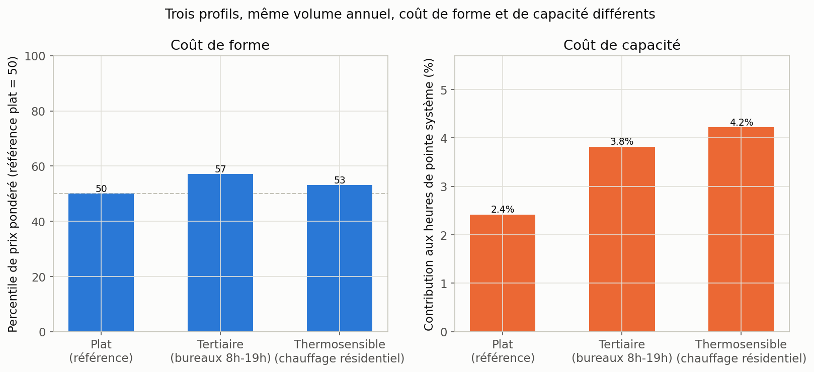
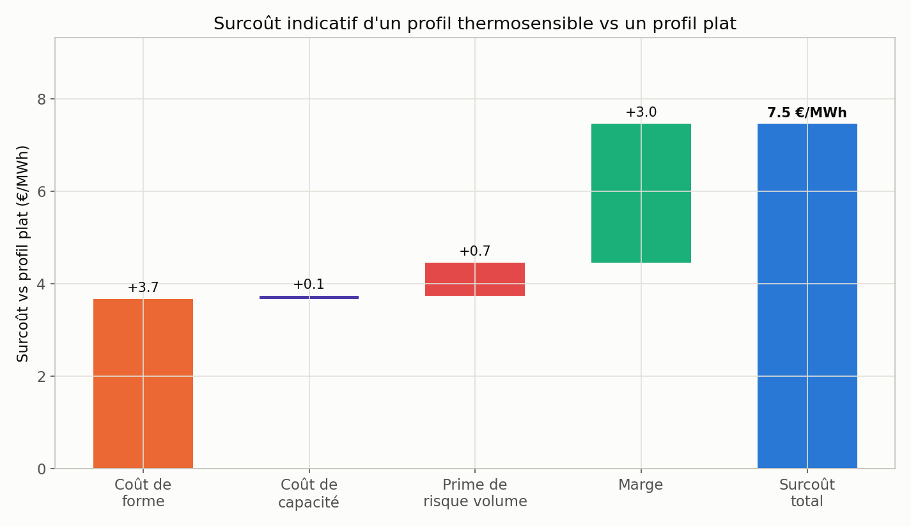

# Construction du prix d'un contrat — angle pricing

*Généré à partir de `src/pricing.py`, sur les mêmes données RTE éCO2mix (2018-2026).
Chiffres tirés de `outputs/key_results_pricing.json`.*

Un fournisseur qui ne produit pas sa propre électricité achète l'intégralité de son
approvisionnement sur les marchés de gros, puis le revend à ses clients sous forme d'un
prix ferme au MWh. Ce prix combine schématiquement : un prix de marché de référence, un
coût de forme (l'écart entre le profil horaire du client et un produit "base" plat), un
coût de capacité (la contribution du client aux heures de tension du système), une
prime de risque (l'incertitude sur le volume réellement livré) et une marge
commerciale. Ce document quantifie chacune de ces composantes à partir des données
réellement collectées pour ce projet, sans disposer de prix de marché réels (l'accès à
ENTSO-E nécessite une clé API individuelle, non obtenue au moment de la rédaction).

## Principe : un indice de prix sans donnée de prix

En l'absence de série de prix spot réelle, ce module construit un **indice de prix
relatif** dérivé du merit order (voir [`rapport_marche.md`](rapport_marche.md),
section 1) : à chaque heure, on calcule le **rang percentile de la charge résiduelle**
(consommation − éolien − solaire) parmi les heures du même mois. Une heure au 90ᵉ
percentile est une heure de forte tension système (donc statistiquement une heure de
prix élevé) ; une heure au 10ᵉ percentile est une heure de forte abondance renouvelable
(donc statistiquement une heure de prix bas, voire négatif). Cet indice est **réel**
(calculé sur données observées) mais **relatif** : il classe les heures entre elles, il
ne prétend pas reconstituer un niveau de prix en euros.

## Trois profils de consommation, mêmes données de demande système

Pour illustrer l'effet de la forme d'un profil sur son coût, on définit trois profils
synthétiques (poids horaires sur une année, normalisés pour représenter le même volume
total) :

| Profil | Construction |
|---|---|
| **Plat** (référence) | Poids uniforme sur toutes les heures — produit "base" |
| **Tertiaire** | Poids fort en semaine 8h-19h, réduit le reste du temps — profil de bureaux typique |
| **Thermosensible** | Poids de base + surpoids proportionnel au **HDD réel du jour** (degrés-jours de chauffe, mêmes données que [`rapport.md`](rapport.md)), concentré sur les heures de chauffage (7h-9h, 18h-21h) — profil résidentiel à chauffage électrique |

Le profil "thermosensible" n'est pas un profil client réel : c'est une forme stylisée
construite à partir de la vraie série de degrés-jours 2018-2026, pour représenter un
comportement de chauffage électrique plausible.

## Résultat 1 — le coût de forme et de capacité dépendent de la forme, pas du volume

| Profil | Percentile de prix pondéré (référence plat = 50) | Contribution aux 200 heures les plus chargées de l'année |
|---|---|---|
| Plat | 50,1 | 2,4 % |
| Tertiaire | 57,1 | 3,8 % |
| Thermosensible | 53,1 | 4,2 % |

À volume annuel strictement identique, le profil tertiaire consomme en moyenne à des
heures plus chargées du système (percentile 57 vs 50) — logique, puisqu'il est
concentré sur les heures ouvrées où la demande nationale est structurellement plus
haute (cf. heatmap, [`rapport_marche.md`](rapport_marche.md) section 3). Le profil
thermosensible, lui, contribue proportionnellement presque deux fois plus aux heures de
pointe système (4,2 % contre 2,4 % pour un profil plat) : son surpoids sur les heures de
chauffage du soir (18h-21h) coïncide directement avec la pointe hivernale du système.

## Résultat 2 — traduction en surcoût, profil thermosensible vs profil plat

| Composante | Valeur | Base de calcul |
|---|---|---|
| Coût de forme | **+3,7 €/MWh** | Écart de percentile de prix pondéré (réel) × un écart de prix illustratif 30-150 €/MWh entre percentile 0 et 100 (hypothèse, cf. tableau des paramètres) |
| Coût de capacité | **+0,1 €/MWh** | Écart de contribution à la pointe (réel) × un prix illustratif de la garantie de capacité de 30 000 €/MW/an (hypothèse, ordre de grandeur des enchères RTE — à remplacer par la valeur publiée l'année du pricing) |
| Prime de risque volume | **+0,7 €/MWh** | Calcul entièrement réel : variabilité interannuelle observée des degrés-jours (2018-2025, hors 2020) appliquée au coefficient de thermosensibilité estimé section 4 de [`rapport.md`](rapport.md) (1 515 MW/degré-jour), pour un portefeuille illustratif de 1 % de la consommation française |
| Marge commerciale | **+3,0 €/MWh** | Hypothèse forfaitaire |
| **Surcoût total** | **≈ +7,5 €/MWh** | Somme des composantes ci-dessus |

Deux composantes sont directement issues des données observées (coût de forme, coût de
capacité) ; une est un calcul réel appliqué à un paramètre d'échelle choisi (prime de
risque) ; deux sont des hypothèses explicites de calibration (prix de la capacité, prix
implicite bas/haut du percentile). Le tableau des paramètres ci-dessous les rassemble
pour que chaque chiffre du surcoût final soit traçable.

## Paramètres et hypothèses

| Paramètre | Valeur retenue | Statut |
|---|---|---|
| Part de marché du portefeuille illustratif | 1 % de la consommation française | Hypothèse (choix d'échelle) |
| Prix de la garantie de capacité | 30 000 €/MW/an | Hypothèse (ordre de grandeur, non calibré sur la valeur réelle de l'année) |
| Prix implicite bas (percentile 0) | 30 €/MWh | Hypothèse (ordre de grandeur du marché français) |
| Prix implicite haut (percentile 100) | 150 €/MWh | Hypothèse (ordre de grandeur du marché français) |
| Volatilité de prix pour la prime de risque | 80 €/MWh | Hypothèse (coût d'achat complémentaire en période de tension) |
| Marge commerciale | 3 €/MWh | Hypothèse forfaitaire |
| Seuil de la zone de pointe | 200 heures/an les plus chargées | Choix méthodologique (cohérent avec [`rapport_marche.md`](rapport_marche.md) section 2) |

## Un point de calibration réel : la consommation française reconstituée

La consommation annuelle française moyenne recalculée à partir des données brutes
(2018-2025, hors 2020) est de **≈ 455 TWh/an** — cohérente avec les ordres de grandeur
publiquement connus de la consommation électrique française. Cette cohérence sert de
vérification de bout en bout du pipeline de données (téléchargement, agrégation,
calculs) indépendamment des paramètres illustratifs listés ci-dessus.

## Limites de cette approche

- L'indice de prix est un **proxy relatif**, pas une reconstruction du niveau de prix
  réel : il capture correctement l'ordre des heures (quand le système est tendu vs
  abondant) mais pas l'amplitude réelle des variations de prix, qui dépend aussi du prix
  du gaz, du CO2, des interconnexions et d'effets de marché non modélisés ici.
- Les trois profils sont des formes stylisées, pas des profils de clients réels
  mesurés — utiles pour illustrer le mécanisme, pas pour chiffrer un contrat réel.
- Les paramètres de conversion (prix de la capacité, fourchette de prix bas/haut,
  volatilité) sont des hypothèses explicites, choisies pour être des ordres de grandeur
  plausibles, pas des valeurs de marché calibrées.
- Avec un accès aux données ENTSO-E (prix spot réels), le coût de forme pourrait être
  recalculé directement (corrélation profil × prix observé) sans hypothèse de fourchette
  de prix, et la prime de risque pourrait intégrer la volatilité de prix réellement
  observée plutôt qu'une valeur illustrative.
