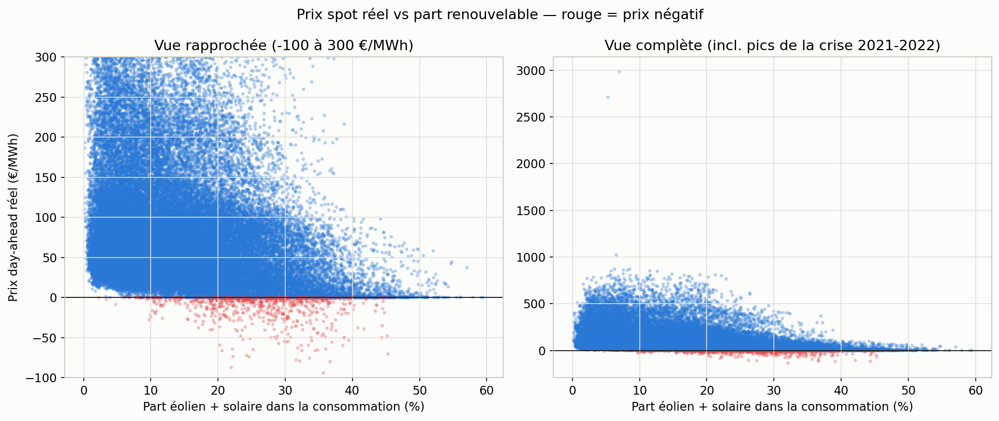
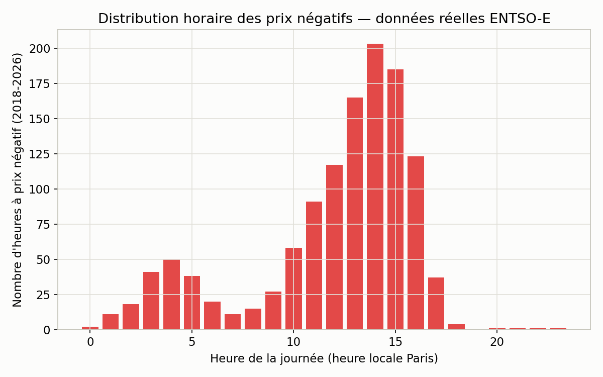
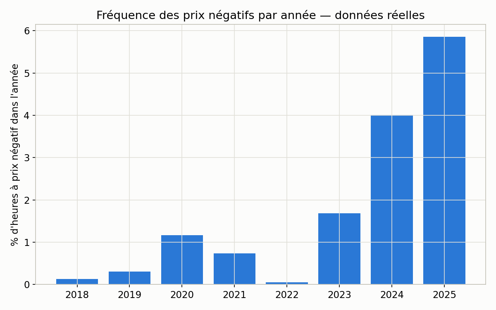

# Construction du prix d'un contrat — angle pricing

*Généré à partir de `src/pricing.py`, sur les vraies données de prix day-ahead ENTSO-E
(2018-2026, via `src/fetch_price.py` et `src/model_price.py`) croisées avec le mix de
production RTE et les degrés-jours réels. Chiffres tirés de
`outputs/key_results_pricing.json` et `outputs/key_results_price.json`.*

Un fournisseur qui ne produit pas sa propre électricité achète l'intégralité de son
approvisionnement sur les marchés de gros, puis le revend à ses clients sous forme d'un
prix ferme au MWh. Ce prix combine schématiquement : un prix de marché de référence, un
coût de forme (l'écart entre le profil horaire du client et un produit "base" plat), un
coût de capacité (la contribution du client aux heures de tension du système), une
prime de risque (l'incertitude sur le volume réellement livré) et une marge
commerciale. Ce document quantifie chacune de ces composantes à partir de données de
prix de marché **réelles**.

## Le marché français vu à travers 8 ans de prix réels

| Indicateur | Valeur |
|---|---|
| Période couverte | 2018-01-01 → 2026-01-01 |
| Prix moyen | 90,3 €/MWh |
| Prix médian | 58,0 €/MWh |
| Écart-type | 99,5 €/MWh |
| Heures à prix négatif | 1 220 / 70 138 (1,74 %) |

L'écart massif entre moyenne (90,3 €/MWh) et médiane (58,0 €/MWh) reflète la crise
énergétique de 2021-2022 (prix du gaz, indisponibilités du parc nucléaire français) :
quelques milliers d'heures à prix extrême tirent la moyenne très au-dessus du niveau
"normal" du marché — un rappel concret que le risque de queue de distribution, pas
seulement la moyenne, est ce qu'un pricing analyst doit couvrir.

Sur les heures à prix négatif, la part éolien + solaire atteint en moyenne **27,1 %**
de la consommation, contre **13,2 %** en moyenne générale — plus du double,
confirmation directe par la donnée du mécanisme merit order décrit dans
[`rapport_marche.md`](rapport_marche.md).

Les prix négatifs se concentrent nettement entre 11h et 17h, avec un pic à 14h — l'heure
de plus forte production solaire, exactement comme prédit par la "duck curve" construite
sur le merit order (rapport_marche.md, section 4).

La fréquence des prix négatifs est passée de **0,1 % des heures en 2018 à 5,9 % en
2025** — une progression x50 sur la période, cohérente avec la montée de la part
renouvelable (rapport_marche.md, section 5). Le creux de 2022 correspond à la crise
énergétique : prix du gaz extrêmes et disponibilité nucléaire réduite ont rendu les
épisodes de surproduction relative beaucoup plus rares cette année-là.

## Trois profils de consommation, même volume, prix réel différent

Pour illustrer l'effet de la forme d'un profil sur son coût, on définit trois profils
synthétiques (poids horaires sur une année, normalisés pour représenter le même volume
total) :

| Profil | Construction |
|---|---|
| **Plat** (référence) | Poids uniforme sur toutes les heures — produit "base" |
| **Tertiaire** | Poids fort en semaine 8h-19h, réduit le reste du temps — profil de bureaux typique |
| **Thermosensible** | Poids de base + surpoids proportionnel au **HDD réel du jour** (mêmes données que [`rapport.md`](rapport.md)), concentré sur les heures de chauffage (7h-9h, 18h-21h) — profil résidentiel à chauffage électrique |

Le profil "thermosensible" n'est pas un profil client réel : c'est une forme stylisée
construite à partir de la vraie série de degrés-jours 2018-2026, pour représenter un
comportement de chauffage électrique plausible. La grandeur qui les compare — le prix
day-ahead moyen pondéré par profil — est en revanche entièrement réelle.

| Profil | Prix day-ahead moyen pondéré (réel) | Contribution aux 200 heures les plus chargées de l'année |
|---|---|---|
| Plat | 90,3 €/MWh | 2,3 % |
| Tertiaire | 96,8 €/MWh (**+6,5 €/MWh**) | 3,7 % |
| Thermosensible | 94,7 €/MWh (**+4,4 €/MWh**) | 4,0 % |

À volume annuel strictement identique, le profil tertiaire paie en moyenne 6,5 €/MWh de
plus que le profil plat — il consomme structurellement aux heures ouvrées où la demande
système, donc le prix, est plus élevé. Le profil thermosensible, lui, contribue près de
deux fois plus aux heures de pointe système (4,0 % contre 2,3 % pour un profil plat) :
son surpoids sur les heures de chauffage du soir coïncide directement avec la pointe
hivernale du système.

## Décomposition du surcoût — profil thermosensible vs profil plat

| Composante | Valeur | Base de calcul |
|---|---|---|
| Coût de forme | **+4,4 €/MWh** | Écart de prix day-ahead réel moyen pondéré entre les deux profils — 100 % calculé sur données observées |
| Coût de capacité | **+0,1 €/MWh** | Écart de contribution à la pointe (réel) × un prix illustratif de la garantie de capacité de 30 000 €/MW/an (hypothèse, ordre de grandeur des enchères RTE — à remplacer par la valeur publiée l'année du pricing) |
| Prime de risque volume | **+0,3 €/MWh** | Calcul réel : sur 2018-2026, le prix moyen en saison de chauffe (nov-mars) est de **130,4 €/MWh** les jours les plus froids (10 % les plus froids, seuil ≈ 15,2 DJ) contre **91,8 €/MWh** les autres jours — un surcoût réel de **+38,6 €/MWh** en jour froid, appliqué à l'exposition volume réelle d'un portefeuille illustratif de 1 % de la consommation française (thermosensibilité réelle 1 515 MW/DJ × variabilité interannuelle réelle des degrés-jours) |
| Marge commerciale | **+3,0 €/MWh** | Hypothèse forfaitaire |
| **Surcoût total** | **≈ +7,8 €/MWh** | Somme des composantes ci-dessus |

Trois composantes sur quatre sont désormais calculées directement sur données réelles
(coût de forme, coût de capacité pour sa partie contribution, prime de risque) ; seuls
le prix de la garantie de capacité et la marge commerciale restent des paramètres
explicites.

## Paramètres restants

| Paramètre | Valeur retenue | Statut |
|---|---|---|
| Part de marché du portefeuille illustratif | 1 % de la consommation française | Choix d'échelle (nécessaire pour donner un volume de référence) |
| Prix de la garantie de capacité | 30 000 €/MW/an | Hypothèse (ordre de grandeur, non calibré sur la valeur réelle de l'année) |
| Marge commerciale | 3 €/MWh | Hypothèse forfaitaire |
| Seuil de la zone de pointe | 200 heures/an les plus chargées | Choix méthodologique (cohérent avec [`rapport_marche.md`](rapport_marche.md) section 2) |
| Seuil "jour froid extrême" | 10 % des jours les plus froids de la saison de chauffe (nov-mars) | Choix méthodologique |

## Limites de cette approche

- Les trois profils sont des formes stylisées, pas des profils de clients réels
  mesurés — utiles pour illustrer le mécanisme et comparer des formes entre elles, pas
  pour chiffrer un contrat réel avec un client donné.
- Le prix de la garantie de capacité reste un paramètre externe non calibré : les
  résultats d'enchères RTE réels sont publics mais n'ont pas été intégrés ici.
- La prime de risque isole l'effet du **froid** sur le prix (saison de chauffe
  novembre-mars) ; elle ne couvre pas symétriquement le risque de chaleur extrême l'été
  (climatisation), plus faible mais non nul (cf. coefficient CDD, [`rapport.md`](rapport.md)).
- Le modèle de prix sous-jacent ([`outputs/model_price_summary.txt`](model_price_summary.txt))
  a un R² de 0,37 : la consommation, la part renouvelable et le nucléaire n'expliquent
  qu'une partie modérée de la variance du prix réel — le gaz, le CO2, les
  interconnexions et les événements de marché (crise 2021-2022) jouent un rôle que ce
  projet ne modélise pas.
